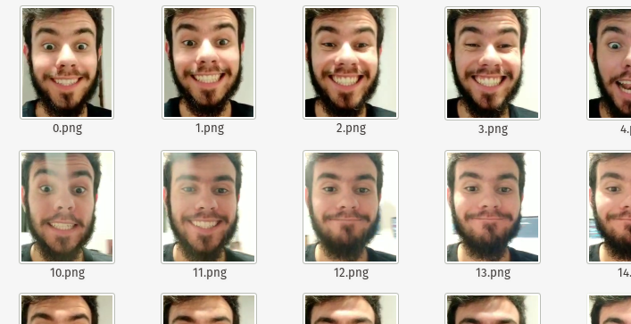

# Face-dataset-creator

It's a face extractor from videos and images to create a dataset about face images

## Usage
Do you want to get faces from a video?
``` shell
python3 main.py --input_video <video_path.mp4> --output <FOLDER_TO_SAVE_FACE_IMAGES> --skip <SKIP_X_FRAMES_PER_SECOND> --verbose <0_1>
```

Do you want to get faces from a folder with many images?
``` shell
python3 main.py --input_folder <video_path.mp4> --output <FOLDER_TO_SAVE_FACE_IMAGES>  --verbose <0_1>
```

Example:
``` shell
python3 face_generator.py --input_video feliz.mp4 --output ./datset --skip 10 --verbose 0
```

## Results example
Input a video or image folder -> get your face images, example:
- Input


- Output



